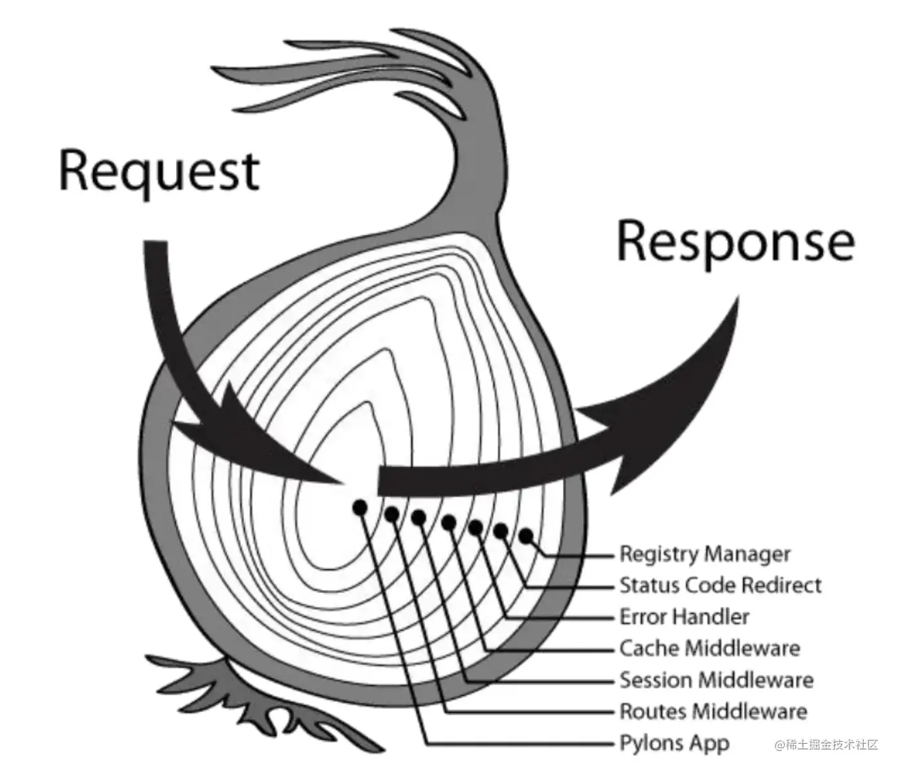
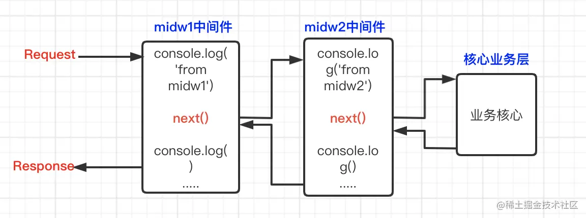
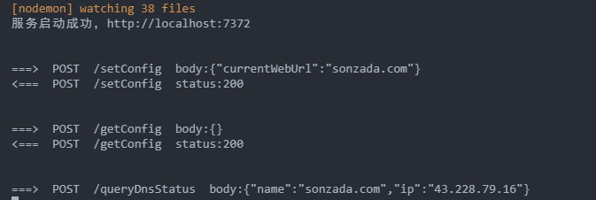

# `koa2` 中间件

很多博文介绍koa2会引用以下这张洋葱图，这张图告诉我们，当服务接受到一个 `Request` ，会依此从外层往里执行，输出响应 `Response` 的过程是从内往外执行。对应图中的业务，

执行顺序依次是：
`Request` -> `Registry Manager` -> `Status Code Redirect` -> `Error Handler` -> `Cache` -> `Session` -> `Routes` -> `Pylons App`




代码示例：

```js
const Koa = require('koa')
const app = new Koa()

// 中间件midw1
function midw1 (ctx, next) {
  console.log('from midw1 前')
  next()
  console.log('from midw1 后')
}
// 中间件midw2
function midw2 (ctx, next) {
  console.log('from midw2 前')
  next()
  console.log('from midw2 后')
}

function process (ctx) {
  console.log('from core process')
}
app.use(midw1)
app.use(midw2)
app.use(process)

app.listen(7372, () => {
  console.log('服务启动成功，http://localhost:7372')
})


// 在终端运行node app.js
// 当浏览器发起一个http://localhost:7372/ 请求时，输出如下：
// from midw1 前
// from midw2 前
// from core process
// from midw2 后
// from midw1 后
```

通过上述这个简短的demo可知：

1. koa中间件的执行严格按照use注册顺序，最先注册的，最先获取Request，但是最后执行完，比作洋葱的最外层。
2. 当执行过程中遇到next，就开始执行里层的中间件。next将每一个中间件的执行分为两段，从当前执行上下文转移到里层。



### 制作简单的日志中间件

输出`请求路径`和 `请求参数`

```js
const Koa = require('koa')
const { bodyParser } = require('@koa/bodyparser')

const app = new Koa()

// 获取请求参数使用 `@koa/bodyparser` 插件，方便开发

/*  注意要在第一个注册 bodyParser 插件 ，上文也说了 koa中间件的执行严格按照use注册顺序  */
app.use(bodyParser())

app.use(async (ctx, next) => {
    if (ctx.method !== 'OPTIONS') {
      console.log('\n')
      console.log(`===>  ${ctx.method}  ${ctx.url}  body:${JSON.stringify(ctx.request.body)}`)
    }
    await next()
    if (ctx.method !== 'OPTIONS') {
      console.log(`<===  ${ctx.method}  ${ctx.url}  status:${ctx.status}`)
    }
})

app.listen(7372, () => {
  console.log('服务启动成功，http://localhost:7372')
})

```

完成，这样就可以完成输出`请求路径`和 `请求参数`的中间，请看下图：



