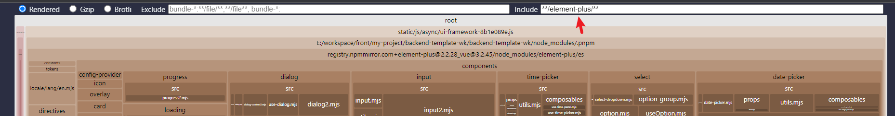
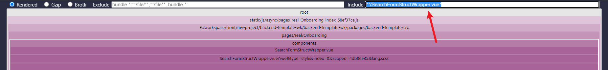
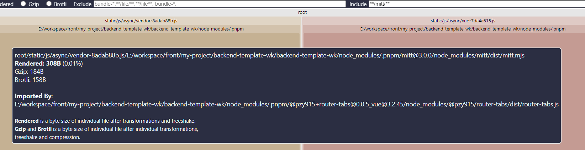
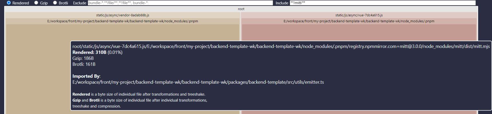
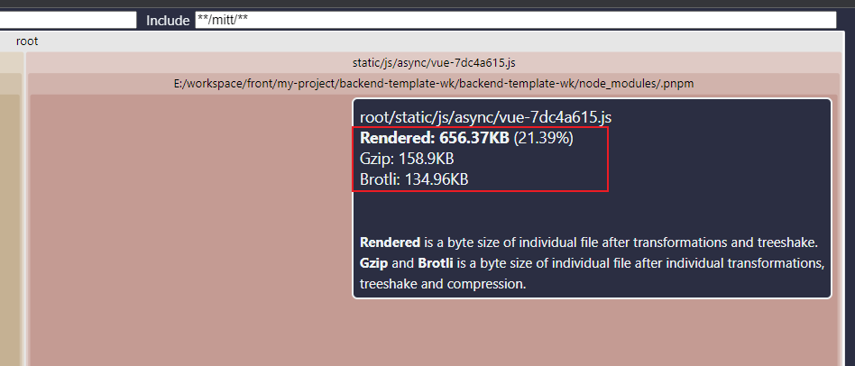

# {{$frontmatter.title}}

## 安装与配置

安装

```shell
pnpm add rollup-plugin-visualizer -D
```

配置

`vite.config.ts`

```ts
import { visualizer } from 'rollup-plugin-visualizer'

export default ({ command, mode }: ConfigEnv): UserConfigExport => {
  return {
    plubins: [
      visualizer({
        filename: './node_modules/.cache/visualizer/stats.html',
        open: true,
        gzipSize: true,
        brotliSize: true,
        /**
         * 图表类型
         * 默认: treemap
         *
         * 可选值: treemap, sunburst, network, raw-data, list
         *
         * sunburst, treemap: 用于查找大bundle
         */
        template: 'treemap',
      }),
    ],
  }
}
```

## 查找(重点)

他的 include 和 exclude 的语法用的是: [picomatch](https://github.com/micromatch/picomatch)

```js
const pm = require('picomatch')
const isMatch = pm('*.js')

console.log(isMatch('abcd')) //=> false
console.log(isMatch('a.js')) //=> true
console.log(isMatch('a.md')) //=> false
console.log(isMatch('a/b.js')) //=> false
```

```js
const picomatch = require('picomatch')
// picomatch(glob[, options]);

const isMatch = picomatch('*.!(*a)')
console.log(isMatch('a.a')) //=> false
console.log(isMatch('a.b')) //=> true
```

### 实际使用

#### 查看指定包是否被重复打包

- 查看`mitt`包是否被重复打包

include: `**/mitt/**`

- 查看`dayjs`包是否被重复打包

include: `**/dayjs/**`

- 查看`@pzy915/backend-layout`包是否被重复打包

include: `**/@pzy915/backend-layout/**`

- 查看`element-plus`包是否被重复打包

include: `**/element-plus/**`



#### 查看指定文件是否被重复引用

include: `**/SearchFormStructWrapper.vue*`



#### 查看指定第三方包在特定 bunlde 中是哪个文件对他进行了引用

下图可以看出`mitt`包在名为`vendor`的 boundle 中的`@pzy915/router-tabs`组件的`router-tabs.js`文件中被引用



下图可以看出`mitt`包在名为`vue`的 boundle 中的`src/util/emitter.ts`文件中被引用



#### 查看某个特定 bundle 的大小


