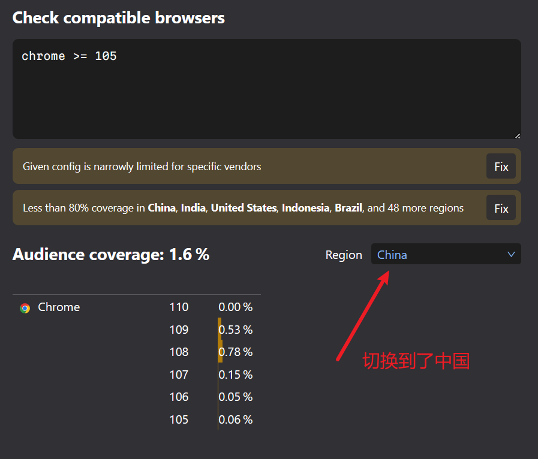

# {{$frontmatter.title}}

## 为什么要进行打包优化

## 有哪些优化点

- css 打包优化
- 图片资源压缩
- 第三方组件引入优化(按需引入以及 CDN 引入)
- 打包后的 js/css 结果压缩优化
- 自动删除 console.log
- 自己编写的模块进行拆包/合包/按需引入

## vite 默认有哪些优化

[vite 官网：构建优化](https://cn.vitejs.dev/guide/features.html#build-optimizations)

### CSS 代码分割

Vite 会自动地将一个异步 chunk 模块中使用到的 CSS 代码抽取出来并为其生成一个单独的文件。这个 CSS 文件将在该异步 chunk 加载完成时自动通过一个 `<link>` 标签载入，该异步 `chunk` 会保证只在 `CSS` 加载完毕后再执行，避免发生 FOUC 。

如果你更倾向于将所有的 CSS 抽取到一个文件中，你可以通过设置 build.cssCodeSplit 为 false 来禁用 CSS 代码分割。

### 异步 Chunk 加载优化

在实际项目中，Rollup 通常会生成 “共用” chunk —— 被两个或以上的其他 chunk 共享的 chunk。与动态导入相结合，会很容易出现下面这种场景：


在无优化的情境下，当异步 chunk A 被导入时，浏览器将必须请求和解析 A，然后它才能弄清楚它也需要共用 chunk C。这会导致额外的网络往返：

```
Entry ---> A ---> C
```

Vite 将使用一个预加载步骤自动重写代码，来分割动态导入调用，以实现当 A 被请求时，C 也将 同时 被请求：

```
Entry ---> (A + C)
```

C 也可能有更深的导入，在未优化的场景中，这会导致更多的网络往返。Vite 的优化会跟踪所有的直接导入，无论导入的深度如何，都能够完全消除不必要的往返。

## css 打包优化

1. 使用 [postcss-preset-env](https://preset-env.cssdb.org/) 将一些现代的 CSS 特性，转成大多数浏览器认识的 CSS，并且会根据目标浏览器或运行时环境添加所需的 polyfill

2. 使用 [cssnano](https://www.cssnano.cn/) 压缩 css

**现代的 CSS 特性是指什么？**

我们使用的十六进制颜色码是 6 位的（# 后面跟 6 位十六进制数，如 #123456），第 1、2 位代表 r（red），第 3、4 位代表 g（green），第 5、6 位代表 b（blue）。但事实上还有一种写法，即使用 8 位的十六进制颜色码（如 #12345678），最后两位代表 a（alpha 透明度），这样来写后，最后的两位会生效吗？答案是有些浏览器会生效，有些则不会，这与浏览器能否正常解析 8 位的十六进制颜色码有关。

**`会根据目标浏览器或运行时环境添加所需的 polyfill` 这句话什么意思？**

以通过 css 禁止用户选择为例，通常我们会这么写

```css
body {
  user-select: none;
}
```

将`browserslist`设置为`defaults`, 经过`postcss-preset-env`处理后会变成这样

```css
body {
  -webkit-user-select: none;
  -moz-user-select: none;
  user-select: none;
}
```

### 配置方式

#### 依赖安装与配置

```
pnpm add postcss-preset-env cssnano -D
```

项目根目录创建`postcss.config.cjs`文件

```js
module.exports = {
  plugins: {
    'postcss-preset-env': {},
    /*
      cssnano作用:将css进行打包优化，能够减小打包后的css体积
      (如何看是否有效: 去掉这个配置，打包一次截图css的体积，加上这个配置再打包一次，
        对比两次打包后css的体积变化，会发现加了这个配置体积会小一点). 
        官网: https://www.cssnano.cn/docs/what-are-optimisations/
       */
    cssnano: {},
  },
}
```

`package.json`添加`browserslist`配置

```json
{
  "name": "project-template",
  "private": true,
  "version": "0.0.0",
  "type": "module",
  "browserslist": ["defaults", "Android >= 4.4", "iOS >= 12.0", "ie >= 11", "Firefox > 69", "chrome >= 69"]
}
```

#### 关于 browserslist

**browserslist 本身的作用?**

browserslist 是一个用特定语句查询浏览器列表的工具

```shell
# 查询 Chrome 最后的两个版本
npx browserslist "last 2 Chrome versions"
chrome 96
chrome 95

# 查询全球市场占有率大于 10% 的浏览器
npx browserslist "> 10%"
and_chr 96
chrome 95
```

**在项目中的作用?**

市面上有很多浏览器，每种浏览器又有不同的版本，所支持的环境各不相同，为了抹平它们之间的差异，于是出现了 Pollyfill 解决方案，Pollyfill 的作用是通过降级处理，让新的语法能够运行在其不被支持的浏览器环境中，常见的 Pollyfill 有 Babel、Autoprefixer 等。

以 Babel 为例，它是怎么判断项目是否需要做降级处理的呢，答案就是通过 browserslist 查询出需要支持的浏览器列表，然后根据这个列表来做判断。

#### 查看当前配置的 browserslist 值覆盖的浏览器和浏览器市场份额

[browserslist 官网](https://browsersl.ist/)


以`chrome >= 105`配置为例





## 图片资源压缩

通过[vite-plugin-imagemin](https://github.com/vbenjs/vite-plugin-imagemin/blob/main/README.zh_CN.md)对图片资源进行压缩

众所周知的网络环境问题，导致插件不可用

## 第三方组件引入优化

### import()函数对 js 模块进行异步引入

```js
button.addEventListener('click', event => {
  import('./dialogBox.js')
    .then(dialogBox => {
      dialogBox.open()
    })
    .catch(error => {
      /* Error handling */
    })
})
```

### 将很少变动的第三方依赖单独打入一个包

**作用：** 提供缓存的命中率

如: `vue`,`router`,`pinia`基本不会变，那么将这 3 个依赖单独打入一个包

### 使用 cdn

**一般公司的管理系统好像用不上，通常没有额外的 CDN 费用预算。**

正式项目不要尝试免费的 CDN，免费的代价是很高的。

:::tip

1. 使用 cdn 引入的依赖不能再使用按需引入，必须全量引入
2. 第三方依赖的依赖项也必须使用 cdn 引入，且本地也必须`pnpm add`这个依赖项（即使该依赖项并未直接使用）【这点可以不强制这么做，但为了明确版本信息最好这么做】，且引入顺序也分先后。如: pinia, 如果不使用 cdn 方式，那那只要直接引入 pinia 即可，使用了 cdn 方式，还必须引入 vue-demi，且 vue-demi 必须再 pinia 之前引入
3. 当某个第三方依赖是通过 cdn 引入，那这个第三方依赖的依赖，也必须通过 cdn 方式引入。如：element-plus 是通过 cdn 引入，同时 element-plus 依赖 vue，那么 vue 也必须通过 cdn 方式引入

:::

[vite-plugin-cdn-import](https://github.com/MMF-FE/vite-plugin-cdn-import/blob/master/README.zh-CN.md): 从 CDN 加载 modules 的 vite 插件

允许指定 modules 在生产环境中使用 CDN 引入。

可以减少构建时间,并且提高生产环境中页面加载速度。

```
pnpm add vite-plugin-cdn-import -D
```

```ts
import { Plugin as importToCDN } from 'vite-plugin-cdn-import'

/**
 * 打包时采用`cdn`模式，仅限外网使用（默认不采用，如果需要采用cdn模式，请在 .env.production 文件，将 VITE_CDN 设置成true）
 * 平台采用国内cdn：https://www.bootcdn.cn，当然你也可以选择 https://unpkg.com 或者 https://www.jsdelivr.com
 * 提醒：mockjs不能用cdn模式引入，会报错。正确的方式是，生产环境删除mockjs，使用真实的后端请求
 * 注意：上面提到的仅限外网使用也不是完全肯定的，如果你们公司内网部署的有相关js、css文件，也可以将下面配置对应改一下，整一套内网版cdn
 */
export const importCDN = importToCDN({
  //（prodUrl解释： name: 对应下面modules的name，version: 自动读取本地package.json中dependencies依赖中对应包的版本号，path: 对应下面modules的path，当然也可写完整路径，会替换prodUrl）
  prodUrl: 'https://cdn.bootcdn.net/ajax/libs/{name}/{version}/{path}',
  modules: [
    {
      name: 'vue',
      var: 'Vue',
      path: 'vue.global.prod.min.js',
    },
    {
      name: 'vue-router',
      var: 'VueRouter',
      path: 'vue-router.global.min.js',
    },
    {
      name: 'vue-i18n',
      var: 'VueI18n',
      path: 'vue-i18n.runtime.global.prod.min.js',
    },
    // 项目中没有直接安装vue-demi，但是pinia用到了，所以需要在引入pinia前引入vue-demi（https://github.com/vuejs/pinia/blob/v2/packages/pinia/package.json#L77）
    {
      name: 'vue-demi',
      var: 'VueDemi',
      path: 'index.iife.min.js',
    },
    {
      name: 'pinia',
      var: 'Pinia',
      path: 'pinia.iife.min.js',
    },
    {
      name: 'element-plus',
      var: 'ElementPlus',
      path: 'index.full.min.js',
      css: 'index.min.css',
    },
    {
      name: 'axios',
      var: 'axios',
      path: 'axios.min.js',
    },
    {
      name: 'dayjs',
      var: 'dayjs',
      path: 'dayjs.min.js',
    },
    // {
    //   name: 'echarts',
    //   var: 'echarts',
    //   path: 'echarts.min.js',
    // },
  ],
})
```

## 自己编写的模块进行拆包/合包/按需引入

### 路由相关

#### 路由懒加载

```ts
// 将
// import UserDetails from './views/UserDetails.vue'
// 替换成
const UserDetails = () => import('./views/UserDetails.vue')

const router = createRouter({
  // ...
  routes: [{ path: '/users/:id', component: UserDetails }],
})
```

:::tip
[不要在路由中](https://blog.csdn.net/wu_xianqiang/article/details/124676971)使用异步组件。异步组件仍然可以在路由组件中使用，但路由组件本身就是动态导入的。
:::


```ts
// 错误示范
const UserDetails = defineAsyncComponent(() =>
  import('./views/UserDetails.vue')
)

const router = createRouter({
  // ...
  routes: [{ path: '/users/:id', component: UserDetails }],
})
```


#### 把组件按组分块

```js
// vite.config.js
export default defineConfig({
  build: {
    rollupOptions: {
      // https://rollupjs.org/guide/en/#outputmanualchunks
      output: {
        manualChunks: {
          'group-user': [
            './src/UserDetails',
            './src/UserDashboard',
            './src/UserProfileEdit',
          ],
        },
    },
  },
})
```

## 参考资料

[深入 Webpack5 等构建工具系列二(10) - postcss-preset-env 和配置抽取](https://juejin.cn/post/7000141573480513550)

[browserslist 是什么？看这篇就够了](https://juejin.cn/post/7054114633312894983)

[Vite 图片压缩(vite-plugin-imagemin) imagemin error: XXXX 解决办法](https://blog.csdn.net/qq_43806604/article/details/124732352)

[手把手教你开发一个快速、高性能、高质量压缩图片的 Vite 插件](https://juejin.cn/post/7173430592715882526)

[Pure Admin: 打包优化](http://yiming_chang.gitee.io/pure-admin-doc/pages/buildgood/)

[vite cdn 加载 vue ——vite 插件](https://juejin.cn/post/7115215444671201310)
