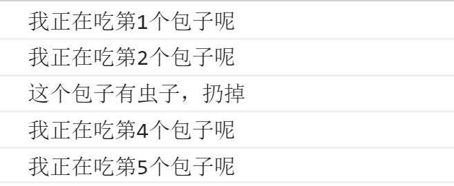

# JavaScript 基础-3 篇

## 1 - 循环

### 1.1 for 循环

- 语法结构

```js
for (初始化变量; 条件表达式; 操作表达式) {
  //循环体
}
```

| 名称       | 作用                                                                                            |
| ---------- | ----------------------------------------------------------------------------------------------- |
| 初始化变量 | 通常被用于初始化一个计数器，该表达式可以使用 var 关键字声明新的变量，这个变量帮我们来记录次数。 |
| 条件表达式 | 用于确定每一次循环是否能被执行。如果结果是 true 就继续循环，否则退出循环。                      |
| 操作表达式 | 用于确定每一次循环是否能被执行。如果结果是 true 就继续循环，否则退出循环。                      |

执行过程：

1. 初始化变量，初始化操作在整个 for 循环只会执行一次。

- 执行条件表达式，如果为 true，则执行循环体语句，否则退出循环，循环结束。

1. 执行操作表达式，此时第一轮结束。
2. 第二轮开始，直接去执行条件表达式（不再初始化变量），如果为 true ，则去执行循环体语句，否则退出循环。
3. 继续执行操作表达式，第二轮结束。
4. 后续跟第二轮一致，直至条件表达式为假，结束整个 for 循环。

断点调试：

```
	断点调试是指自己在程序的某一行设置一个断点，调试时，程序运行到这一行就会停住，
  然后你可以一步一步往下调试，
  调试过程中可以看各个变量当前的值，出错的话，调试到出错的代码行即显示错误，停下。
  断点调试可以帮助观察程序的运行过程
```

```html
断点调试的流程： 1、浏览器中按 F12--> sources -->找到需要调试的文件-->在程序的某一行设置断点 2、Watch:
监视，通过watch可以监视变量的值的变化，非常的常用。
3、摁下F11，程序单步执行，让程序一行一行的执行，这个时候，观察watch中变量的值的变化。
```

- for 循环重复相同的代码

  比如输出 10 句“媳妇我错了”

  ```js
  //  基本写法
  for(var i = 1; i <= 10; i++){
      console.log('媳妇我错了~');
  }
  // 用户输入次数
  var num = prompt('请输入次数:')；
  for ( var i = 1 ; i <= num; i++) {
      console.log('媳妇我错了~');
  }
  ```

- for 循环重复不相同的代码

  例如，求输出 1 到 100 岁：

  ```js
  //  基本写法
  for (var i = 1; i <= 100; i++) {
    console.log('这个人今年' + i + '岁了');
  }
  ```

  例如，求输出 1 到 100 岁，并提示出生、死亡

  ```js
  // for 里面是可以添加其他语句的
  for (var i = 1; i <= 100; i++) {
    if (i == 1) {
      console.log('这个人今年1岁了， 它出生了');
    } else if (i == 100) {
      console.log('这个人今年100岁了，它死了');
    } else {
      console.log('这个人今年' + i + '岁了');
    }
  }
  ```

  for 循环因为有了计数器的存在，还可以重复的执行某些操作，比如做一些算术运算。

### 1.2 双重 for 循环

- 双重 for 循环概述

  循环嵌套是指在一个循环语句中再定义一个循环语句的语法结构，
  例如在 for 循环语句中，可以再嵌套一个 for 循环，这样的 for 循环语句我们称之为双重 for 循环。

- 双重 for 循环语法

  ```js
  for (外循环的初始; 外循环的条件; 外循环的操作表达式) {
    for (内循环的初始; 内循环的条件; 内循环的操作表达式) {
      需执行的代码;
    }
  }
  ```

  - 内层循环可以看做外层循环的循环体语句
  - 内层循环执行的顺序也要遵循 for 循环的执行顺序
  - 外层循环执行一次，内层循环要执行全部次数

- 打印五行五列星星

  ```js
  var star = '';
  for (var j = 1; j <= 3; j++) {
    for (var i = 1; i <= 3; i++) {
      star += '☆';
    }
    // 每次满 5个星星 就 加一次换行
    star += '\n';
  }
  console.log(star);
  ```

  核心逻辑：

  1.内层循环负责一行打印五个星星

  2.外层循环负责打印五行

- for 循环小结

  - for 循环可以重复执行某些相同代码
  - for 循环可以重复执行些许不同的代码，因为我们有计数器
  - for 循环可以重复执行某些操作，比如算术运算符加法操作
  - 随着需求增加，双重 for 循环可以做更多、更好看的效果
  - 双重 for 循环，外层循环一次，内层 for 循环全部执行
  - for 循环是循环条件和数字直接相关的循环

### 1.3 while 循环

while 语句的语法结构如下：

```js
while (条件表达式) {
  // 循环体代码
}
```

执行思路：

- 1 先执行条件表达式，如果结果为 true，则执行循环体代码；如果为 false，则退出循环，执行后面代码
- 2 执行循环体代码
- 3 循环体代码执行完毕后，程序会继续判断执行条件表达式，如条件仍为 true，则会继续执行循环体，直到循环条件为 false 时，整个循环过程才会结束

注意：

- 使用 while 循环时一定要注意，它必须要有退出条件，否则会成为死循环

### 1.4 do-while 循环

do... while 语句的语法结构如下：

```js
do {
  // 循环体代码 - 条件表达式为 true 时重复执行循环体代码
} while (条件表达式);
```

执行思路

- 1 先执行一次循环体代码

- 2 再执行条件表达式，如果结果为 true，则继续执行循环体代码，如果为 false，则退出循环，继续执行后面代码

  注意：先再执行循环体，再判断，do…while 循环语句至少会执行一次循环体代码

### 1.5 continue、break

continue 关键字用于立即跳出本次循环，继续下一次循环（本次循环体中 continue 之后的代码就会少执行一次）。

例如，吃 5 个包子，第 3 个有虫子，就扔掉第 3 个，继续吃第 4 个第 5 个包子，其代码实现如下：

```js
for (var i = 1; i <= 5; i++) {
  if (i == 3) {
    console.log('这个包子有虫子，扔掉');
    continue; // 跳出本次循环，跳出的是第3次循环
  }
  console.log('我正在吃第' + i + '个包子呢');
}
```

运行结果：



break 关键字用于立即跳出整个循环（循环结束）。

例如，吃 5 个包子，吃到第 3 个发现里面有半个虫子，其余的不吃了，其代码实现如下：

```js
for (var i = 1; i <= 5; i++) {
  if (i == 3) {
    break; // 直接退出整个for 循环，跳到整个for下面的语句
  }
  console.log('我正在吃第' + i + '个包子呢');
}
```

运行结果：

  

## 2 - 代码规范

### 2.1 标识符命名规范

- 变量、函数的命名必须要有意义
- 变量的名称一般用名词
- 函数的名称一般用动词

### 2.2 操作符规范

```js
// 操作符的左右两侧各保留一个空格
for (var i = 1; i <= 5; i++) {
  if (i == 3) {
    break; // 直接退出整个 for 循环，跳到整个for循环下面的语句
  }
  console.log('我正在吃第' + i + '个包子呢');
}
```

### 2.3 单行注释规范

```js
for (var i = 1; i <= 5; i++) {
  if (i == 3) {
    break; // 单行注释前面注意有个空格
  }
  console.log('我正在吃第' + i + '个包子呢');
}
```

### 2.4 其他规范

    关键词、操作符之间后加空格


