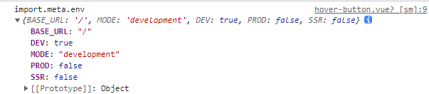
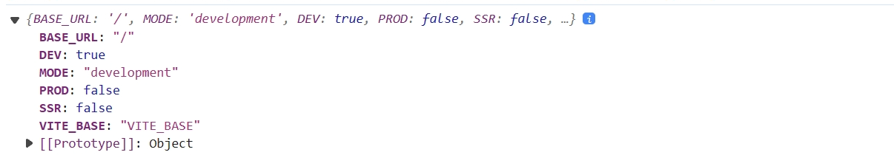
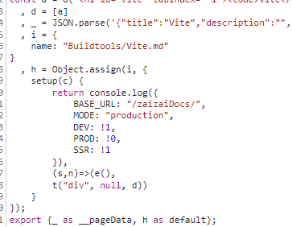

# VitePress

## VitePress 的路径别名

在.vitepress 的 config 配置中添加 vite 配置

```ts
import { defineConfig } from 'vitepress';
import { resolve, join } from 'node:path';
export default () => {
  const pathAlias = (path: string) => resolve(join(__dirname, path));

  return defineConfig({
    vite: {
      resolve: {
        alias: {
          '/~': pathAlias('../components'),
        },
      },
    },
  });
};
```

::: danger 注意：
路径的别名不能使用 `@` 或 `#` 这两个符号，在 vitepress 内部已经使用了，经过测试不能覆盖

所以不要使用，换其他符号
:::


## 环境变量注意情况

`vite` 可以使用 `.env` 文件的方式来配置环境变量，在 `scr/` 下任何地方都可以使用 `import.meta.env` 来读取配置变量，
但是在 `vitepress` 中如果你想在使用 `import.meta.env` 并不能读取到自定义的配置，只能读取到由 `vite` 默认的变量，如下图



当然，你想读取到还是有办法的，经过不断的探索可以在文件直接对 `import.meta.env` 进行赋值

```vue
<script setup>
import.meta.env.VITE_BASE = 'VITE_BASE'
const env = import.meta.env
console.log(env)
</script>
```

这样是可以访问到自定义的配置



::: tip 原理
`vite` 对于 `import.meta.env` 是采用了 **`静态替换`**

>静态替换：对 `import.meta.env` 的字符串直接 替换成 **`对象`** 形式
`vite` 会收集 `import.meta.env` 的代码块，
解析后进行 **`静态替换`**


也就说明了上面的方法可以实现的原因，
:::

所以其实也可以使用 `vite` 开发一个插件直接把所有带有 `import.meta.env` 的文件插入赋值语句这就可以码字了

插件：[`vite插件：Vitepress 全局注入.env变量`](../Buildtools/Vite.md#vite-插件-vitrpress-importmetaurl静态注入)