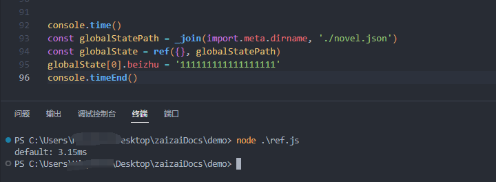

# Proxy在node的小妙用

最近，一直在写这个node的应用或脚本，有时候需要持久化数据，但是又没有必要使用数据库获取其他工具，那怎么办呢？

当然是使用 `json文件` 了，直接保存到本地，看方便，存方便，读方便，非常的合适简单的数据存储。
但是吧...

刚开始我使用的是

```js
1.0
const json = require('./data/1.json')
json.forEach(item => { ... })
...省略
fs.writeFileSync(ph, JSON.stringify(json))

2.0  封装函数
const { getjson, setjson } = require('./utils.js')
const json = getjson('./data/1.json')
json.forEach(item => { ... })
...省略
setjson(ph, json)

/** 经历了很多次变化... 大变化三个吧 **/

3.0 封装函数 + 挂载全局
// main.js
process.getjson = getjson
process.setjson = setjson

// xxxxx.js
const json = process.getjson('./data/1.json')
json.forEach(item => { ... })
...省略
process.setjson(ph, json)
```

看到这里是不是感觉很简单😅，但是一旦写多了而且间隔很近，比如：

```js
[
  {
    url: '/n1',
    init(ctx) {
     const json = process.getjson('./data/1.json')
    json.forEach(item => { ... })
    ...省略
    process.setjson(ph, json)
    }
  },
  {
    url: '/n',
    init(ctx) {
      const json = process.getjson('./data/1.json')
      json.forEach(item => { ... })
      ...省略
      process.setjson(ph, json)
    }
  }
  ...很多个
]
```

写多了就很烦，这是必要的过程，但是就是烦一直在想办法减少代码，一行两行也行啊。
然后刷帖子的时候，看到了 `Proxy的使用场景`(不大记得了，差不多就是这样),
然后我想通一个数据在文件使用多次，那不是也可以使用 `Proxy` 代理一下我就不需要 `读取、保存`了

## 开始

原理：通过 `Proxy` 劫持 `set` 操作，在 `set`的时候把数据保存到本地 `json文件`

首先肯定是开始核心函数了，代码简单

因为最近把环境换成了 `module` ,接下来使用 esm 的模块化

``` js 
import path from 'path'
import fs from 'fs'

export function _join(...props) {
  return path.join(...props)
}

// 保存数据
const saveLocalJson = (ph, data) => {
  try {
    fs.writeFileSync(ph, JSON.stringify(data))
    return true
  } catch (e) {
    console.log(import.meta.dirname, e)
    throw e
  }
}

export default function ref(Deb, filePh) {
  // 初始化读取数据
  let DATA_REF = JSON.parse(fs.readFileSync(filePh).toString()) || Deb
  const handler = {
    get(target, key) {
      return Reflect.get(target, key)
    },
    // 劫持 set 操作
    set(target, key, value) {
      // 先 set 设置最新值
      let res = Reflect.set(target, key, value)
      // 然后保存到本地json文件
      saveLocalJson(filePh, DATA_REF)
      // 使用 Proxy 的 set 需要返回一个 boolean 值
      return res
    }
  }
  return new Proxy(DATA_REF, handler)
}
```

这样基础版本就出来了，使用是没有问题的了，下面使用

``` js
import { ref, _join } from './ref.js'
const ph = _join(import.meta.dirname, '../data/ref.json')
const globalState = ref({name: 'n',current: '当前'}, ph)
export default [{
    url: '/n1',
    init(ctx) {
        ...很多代码
        globalState.name = 'n1'
        globalState.current = '当前: n1'
        ...很多代码
    }
  },
  ...很多个
]
```

这样就不需要每次都需要读取写入在这个文件中只需要使用一次就可以完成了，减少了很多行代码，心态负担低了很多 😝

## 测试
测试一下速度： &emsp; node: 21.6.2  &emsp;  CPU: R5-3600  &emsp; 硬盘：m.2 3000m/s  &emsp; json文件：71.6KB



完成版：3.15ms的速度，完成够用，当然想要更好用就在稍微改改，
下面是完整版代码，虽然还有很多可以加的地方，但是以满足我的需求

## 完整代码

```js 
// ref.js
import path from 'path'
import fs from 'fs'

export function _join(...props) {
  return path.join(...props)
}

function isType(value) {
  return Object.prototype.toString.call(value)
}

export function debounce(fun, wait = 1500) {
  let timeout = null
  return function () {
    if (timeout) {
      clearTimeout(timeout)
    }
    timeout = setTimeout(() => {
      fun.apply(this, arguments)
    }, wait)
  }
}

export const saveLocalJson = (ph, data) => {
  try {
    fs.writeFileSync(ph, JSON.stringify(data))
    return true
  } catch (e) {
    console.log(import.meta.dirname, e)
    throw e
  }
}

// 验证文件存在
export function directoryExistsSync(dirPath) {
  try {
    const stats = fs.statSync(dirPath)
    return stats.isFile()
  } catch (err) {
    console.log('directoryExistsSync ~ err:', err)
    if (err.code === 'ENOENT') {
      return false
    }
    return false
  }
}

export const getLocalJson = ph => {
  if (directoryExistsSync(ph)) {
    return JSON.parse(fs.readFileSync(ph).toString())
  }
  return null
}

/**
 * @function ref
 * @param {[{},string[]]} props
 * @returns
 */
export default function ref(...props) {
  if (props.length === 0) {
    throw Error(`error: 请传入完整参数`)
  }

  let DATA_REF = props.shift()
  let filePh = props.join('/')
  // 初始化读取数据
  DATA_REF = getLocalJson(filePh) || Deb
  // 添加防抖，减少io操作
  const debounceFn = debounce(saveLocalJson, 20)
  const handler = {
    get(target, key) {
      const v = Reflect.get(target, key)
      // 处理多层对象的问题 
      return isType(v) === '[object Object]' ? new Proxy(v, handler) : v
    },
    set(target, key, value) {
      let res = Reflect.set(target, key, value)
      debounceFn(filePh, DATA_REF)
      return res
    }
  }
  DATA_REF = new Proxy(DATA_REF, handler)

  return DATA_REF
}

console.time()
const globalState = ref({}, import.meta.dirname, './novel.json')
console.timeEnd()
```

## 最后的问题

这样的操作就`不能直接替换对象，只能一个属性的修改，才会触发存储`，如果想处理

解决办法: 再嵌套一个对象就像 Vue3 的 ref()一样
```js
const refdata = new Proxy({value: Dep}, handler)
// 触发存储
refdata.value = {}
refdata.value.name = 'asd'
```
缺陷：`在js文件中就缺少了 代码提示，ts中可以传入泛型获得提示`
这就看你需要那个了
