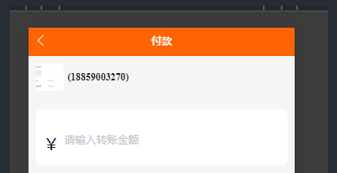

# 小程序随笔

## 原生微信小程序 模块化

截止 2024-2-23，目前微信小程序的模块化默认为 `commonJS ` ,如果你想使用 `ES Module` 就必需要打开 `es6转es5` 的编译项目

> 这样会把所有 es6 的代码全部转换转换为 es5，但是你又不想转换其他的 es6 代码
> 你就得考虑你的项目需求，如果你不想把项目体积小店就不打开 `es6转es5`
> 如果你想使用 `ES Module` 不考虑其他那就随意


## 原生微信小程序 `环境变量` 方案

### `wx.getAccountInfoSync` 官方提供的 API

[文档：获取小程序当前版本信息](https://developers.weixin.qq.com/miniprogram/dev/api/open-api/account-info/wx.getAccountInfoSync.html)

::: danger 缺点：
在提审时有跟问题，提审的版本会认为是 develop 版导致请求的数据是测试版的，然后被审核拒绝。

处理办法：
develop 环境的接口数据尽量模拟正式环境的接口数据
获取直接放正式环境的接口数据
:::

```js
// 自动根据版本切换接口请求地址
const { miniProgram: { envVersion } } = wx.getAccountInfoSync();
let url = '';
switch (envVersion) {
  case 'develop':
    url = `${defaultConfig.devUrl}${params.url}`;
    break;
  case 'trial':
    url = `${defaultConfig.devUrl}${params.url}`;
    break;
  case 'release':
    url = `${defaultConfig.prodUrl}${params.url}`;
    break;
  default:
    url = `${defaultConfig.baseUrl}${params.url}`;
    break;
}
export url
```

### `构建npm功能` 方案

安装了插件并构建 npm 之后，点上传代码，`node_modules` 文件夹是不会上传的，
[project.config.json](https://developers.weixin.qq.com/miniprogram/dev/devtools/projectconfig.html#packOptions)配置项中的 packOptions.ignore 字段，
用以配置打包时对符合指定规则的文件或文件夹进行忽略，以跳过打包的过程，这些文件或文件夹将不会出现在预览或上传的结果内

首先在根目录新建各种文件 `按照自己习惯就好`


接着在终端执行 `npm init`，然后在 `package.json`中进行配置

```json
{
  "type": "module",
  "scripts": {
    "build": "SET NODE_ENV=production && node ./build/index.js",
    "dev": "SET NODE_ENV=development && node ./build/index.js"
  }
}
```

然后在开发者工具设置


最后编写 `./build/index.js`

```js
import fs from 'node:fs'
import path from 'node:path'
import { fileURLToPath } from 'url'

const __dirname = path.dirname(fileURLToPath(import.meta.url))
const ph = path.join(__dirname, '../')
const NODE_ENV = process.env.NODE_ENV
let config = {}

const files = fs.readdirSync(ph).filter(v => v.includes('.env'))
const envFile = NODE_ENV === 'development' ? files[0] : files[1]

let str = fs.readFileSync(path.join(ph, envFile)).toString()
str.split(/\r\n/).forEach(sv => {
  let svs = sv.split('=')
  config[svs[0].trim()] = svs[1].trim()
})
let content = ''
for (const key in config) {
  content += `module.exports.${key} = ${config[key] || "''"}\n`
}
fs.writeFileSync(path.join(__dirname, '../env.js'), content)
```

搞完，收工 :smirk:

## 关于 `某些方法需要再点击事件中才能调用`

这个大概是根据函数调用的层数来计算的。

## 扫码 微信内 h5 支付 

### 方案一

用户使用微信扫一扫=>打开微信 H5=>


=> 输入金额选择微信支付方式(但是没有登录)

=> 点击付款 （需要登录）
请求后端返回了 ctffront.gdctfsz.com/mp 这个目录的 url
然后你需要 window.location.href = url
然后就跳过去微信的登录网页 （这个过程中就是静默登录了）
然后他会在跳转跳转

=> 跳转到达 服务器的文件 它会自动调用支付
支付完成在回来

=》


=> 回来了 查询支付结果，然后提示支付状态

### 方案二

用户使用微信扫一扫=>

打开微信 H5=>来到这样页面


=> 输入金额选择微信支付方式 (但是没有登录)

=> 点击付款 （需要登录）

首先（静默登录），先跳转去这个页面进行 `静默登录`

https://open.weixin.qq.com/connect/oauth2/authorize?appid=wx520c15f417810387&redirect_uri=`{当前页面的URL}`&response_type=code&scope=snsapi_base&state=123#wechat_redirect

`静默登录` 完成后跳转回来 `你的付款页面`

拿你需要拿的数据，然后获取`订单号`

然后调起支付 `调用下面的函数`

```js
function onBridgeReady() {
  WeixinJSBridge.invoke(
    'getBrandWCPayRequest',
    {
      appId: 'wx2421b1c4370ec43b', //公众号ID，由商户传入
      timeStamp: '1395712654', //时间戳，自1970年以来的秒数
      nonceStr: 'e61463f8efa94090b1f366cccfbbb444', //随机串
      package: 'prepay_id=u802345jgfjsdfgsdg888',
      signType: 'MD5', //微信签名方式：
      paySign: '70EA570631E4BB79628FBCA90534C63FF7FADD89' //微信签名
    },
    function (res) {
      if (res.err_msg == 'get_brand_wcpay_request:ok') {
        // 使用以上方式判断前端返回,微信团队郑重提示：
        //res.err_msg将在用户支付成功后返回ok，但并不保证它绝对可靠。
      }
    }
  )
}
// 调用方法
if (typeof WeixinJSBridge == 'undefined') {
  if (document.addEventListener) {
    document.addEventListener('WeixinJSBridgeReady', onBridgeReady, false)
  } else if (document.attachEvent) {
    document.attachEvent('WeixinJSBridgeReady', onBridgeReady)
    document.attachEvent('onWeixinJSBridgeReady', onBridgeReady)
  }
} else {
  onBridgeReady()
}
```


=> 用户支付完成

在回调处理支付完成后

`注`: 一般情况下 提示支付成功 之前先是向后端查询支付成功才提示支付成功，反之失败

这个回调中不能直接确认支付成功

```js
if (res.err_msg == 'get_brand_wcpay_request:ok') {
        // 使用以上方式判断前端返回,微信团队郑重提示：
        //res.err_msg将在用户支付成功后返回ok，但并不保证它绝对可靠。
}
```