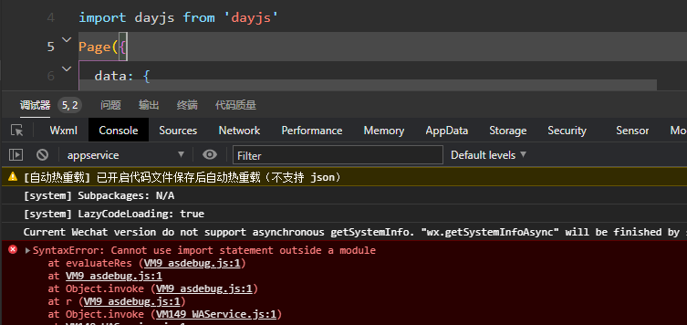
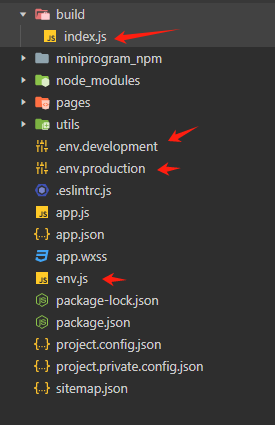
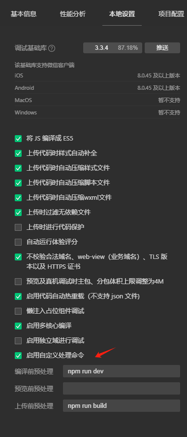

# 小程序随笔

## 原生微信小程序 模块化

截止 2024-2-23，目前微信小程序的模块化默认为 `commonJS ` ,如果你想使用 `ES Module` 就必需要打开 `es6转es5` 的编译项目

> 这样会把所有es6的代码全部转换转换为es5，但是你又不想转换其他的es6代码
> 你就得考虑你的项目需求，如果你不想把项目体积小店就不打开 `es6转es5`
> 如果你想使用 `ES Module` 不考虑其他那就随意



## 原生微信小程序 `环境变量` 方案

### `wx.getAccountInfoSync` 官方提供的API

[文档：获取小程序当前版本信息](https://developers.weixin.qq.com/miniprogram/dev/api/open-api/account-info/wx.getAccountInfoSync.html)

::: danger 缺点：
在提审时有跟问题，提审的版本会认为是develop版导致请求的数据是测试版的，然后被审核拒绝。

处理办法：
develop 环境的接口数据尽量模拟正式环境的接口数据
获取直接放正式环境的接口数据
:::

```js
// 自动根据版本切换接口请求地址
const { miniProgram: { envVersion } } = wx.getAccountInfoSync();
let url = '';
switch (envVersion) {
  case 'develop':
    url = `${defaultConfig.devUrl}${params.url}`;
    break;
  case 'trial':
    url = `${defaultConfig.devUrl}${params.url}`;
    break;
  case 'release':
    url = `${defaultConfig.prodUrl}${params.url}`;
    break;
  default:
    url = `${defaultConfig.baseUrl}${params.url}`;
    break;
}
export url
```

### `构建npm功能` 方案

安装了插件并构建npm之后，点上传代码，`node_modules` 文件夹是不会上传的，
[project.config.json](https://developers.weixin.qq.com/miniprogram/dev/devtools/projectconfig.html#packOptions)配置项中的packOptions.ignore字段，
用以配置打包时对符合指定规则的文件或文件夹进行忽略，以跳过打包的过程，这些文件或文件夹将不会出现在预览或上传的结果内

首先在根目录新建各种文件  `按照自己习惯就好`




接着在终端执行 `npm init`，然后在 `package.json`中进行配置

```json
{
  "type": "module",
  "scripts": {
    "build": "SET NODE_ENV=production && node ./build/index.js",
    "dev": "SET NODE_ENV=development && node ./build/index.js"
  },
}
```

然后在开发者工具设置




最后编写 `./build/index.js`

```js
import fs from 'node:fs'
import path from 'node:path'
import { fileURLToPath } from 'url'

const __dirname = path.dirname(fileURLToPath(import.meta.url))
const ph = path.join(__dirname, '../')
const NODE_ENV = process.env.NODE_ENV
let config = {}

const files = fs.readdirSync(ph).filter(v => v.includes('.env'))
const envFile = NODE_ENV === 'development' ? files[0] : files[1]

let str = fs.readFileSync(path.join(ph, envFile)).toString()
str.split(/\r\n/).forEach(sv => {
  let svs = sv.split('=')
  config[svs[0].trim()] = svs[1].trim()
})
let content = ''
for (const key in config) {
  content += `module.exports.${key} = ${config[key] || '\'\''}\n`
}
fs.writeFileSync(path.join(__dirname, '../env.js'), content)
```

搞完，收工 :smirk:


## 关于 `某些方法需要再点击`

