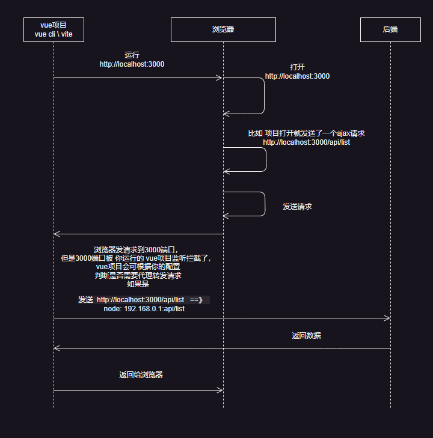

# 随笔档案


## `vue3` `sfc` 多个 `<script lang="tsx">`

`vue3` 可以有多个 `<script>` 标签，但是必须 `lang` 的属性要一样，例如：

```vue
<script></script>

<script setup lang="tsx">
</script>
```

以上这样是不可以的，`可以没有但不能不一样`，如下面就可。

```vue
<script lang="tsx"></script>

<script setup lang="tsx">
</script>
<template></template>
<script lang="tsx"></script>
```

那么这样子的意义何在，目前我觉得就是方便了 `定义一些小组件`

## tsconfig.json 中的 `baseUrl`

::: tip
一般在vscode中都安装了 `Path Intellisense` 这个插件，然后直接定义 `baseUrl` 为 `./` 这样更加方便
:::

然后接下来直接这样

```json
{
  "compilerOptions": {
    "target": "ESNext",
    "baseUrl": "./",
    "paths": {
      "/": ["./docs/*"],
      "/~/*": ["./components/*"]
    },
  },
  "exclude": ["node_modules", ".vite"],
  "include": [
    "./env.d.ts",
    "./components/**/*.ts",
    "./components/*.ts",
    "./components/*.vue",
    "./.vitepress/**/*.ts",
    "./docs/**/**.ts"
  ]
}

```

## vue代理问题

众所周知服务器与服务器之间是没有跨域问题的

`vue cli` 或者 `vite` 的代理都是通过拦截请求后，使用本地node请求到后端，然后在从后端返回到node在返回到浏览器



看图，所以请求是需要发送到 `3000端口` 才可以被拦截到，所以按照这个原理

`代理配置`:

``` ts
import { defineConfig, loadEnv } from 'vite'
import vue from '@vitejs/plugin-vue'

export default defineConfig(configEnv => {
  return {
    plugins: [
      vue(),
    ],
    base: '/',
    server: {
      host: '0.0.0.0',
      port: 3000,
      proxy: {
        '/api': {
          target: 'https://www.xxxx.com',  // 目标地址
          changeOrigin: true,
          rewrite: (path) => {
            console.log("🚀 ~ path:", path)
            return path.replace(/^\/api/, '')
          }
        }
      }
    },
  }
})
```

`axios的baseURL:` 是需要留空的

``` ts
const request = axios.create({
	baseURL: '' // 后端域名接口
});
```

当你发送一个请求，比如：`https://www.xxxx.com/api/get/list` 这样的接口时，在开放环境下 `baseURL`留空，那发出的请求就是 `http://localhost:3000/api/get/list` 这样 `vite \ vue cli` 才能拦截到请求

::: danger 原理：
如果你的 `baseURL` 不留空，浏览器就直接请求了 `https://www.xxxx.com/api/get/list`，没有经过 `3000` 端口，`vite \ vue cli` 拦截不了所以就会代理失败
::: 

拦截到请求会把 `url` 替换 

`http://localhost:3000/api/get/list` ==> `https://www.xxxx.com/api/get/list`

然后使用node发送请求这样就不会有跨域问题了


