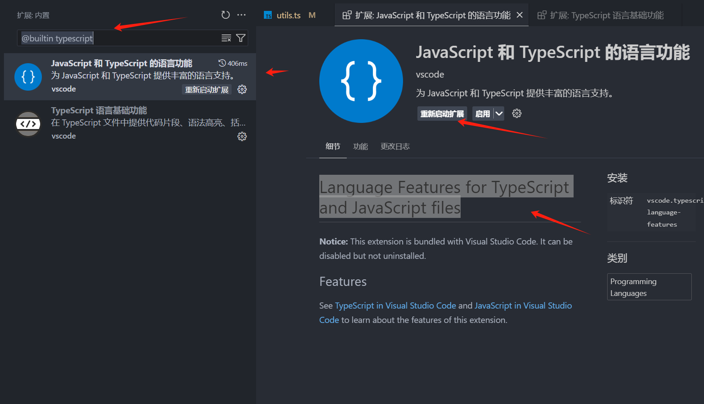

# 随笔档案


## `vue3` `sfc` 多个 `<script lang="tsx">`

`vue3` 可以有多个 `<script>` 标签，但是必须 `lang` 的属性要一样，例如：

```vue
<script></script>

<script setup lang="tsx">
</script>
```

以上这样是不可以的，`可以没有但不能不一样`，如下面就可。

```vue
<script lang="tsx"></script>

<script setup lang="tsx">
</script>
<template></template>
<script lang="tsx"></script>
```

那么这样子的意义何在，目前我觉得就是方便了 `定义一些小组件`

## tsconfig.json 中的 `baseUrl`

::: tip
一般在vscode中都安装了 `Path Intellisense` 这个插件，然后直接定义 `baseUrl` 为 `./` 这样更加方便
:::

然后接下来直接这样

```json
{
  "compilerOptions": {
    "target": "ESNext",
    "baseUrl": "./",
    "paths": {
      "/": ["./docs/*"],
      "/~/*": ["./components/*"]
    },
  },
  "exclude": ["node_modules", ".vite"],
  "include": [
    "./env.d.ts",
    "./components/**/*.ts",
    "./components/*.ts",
    "./components/*.vue",
    "./.vitepress/**/*.ts",
    "./docs/**/**.ts"
  ]
}

```

## vue代理问题

众所周知服务器与服务器之间是没有跨域问题的

`vue cli` 或者 `vite` 的代理都是通过拦截请求后，使用本地node请求到后端，然后在从后端返回到node在返回到浏览器


看图，所以请求是需要发送到 `3000端口` 才可以被拦截到，所以按照这个原理

`代理配置`:

``` ts
import { defineConfig, loadEnv } from 'vite'
import vue from '@vitejs/plugin-vue'

export default defineConfig(configEnv => {
  return {
    plugins: [
      vue(),
    ],
    base: '/',
    server: {
      host: '0.0.0.0',
      port: 3000,
      proxy: {
        '/api': {
          target: 'https://www.xxxx.com',  // 目标地址
          changeOrigin: true,
          rewrite: (path) => {
            console.log("🚀 ~ path:", path)
            return path.replace(/^\/api/, '')
          }
        }
      }
    },
  }
})
```

`axios的baseURL:` 是需要留空的

``` ts
const request = axios.create({
	baseURL: '' // 后端域名接口
});
```

当你发送一个请求，比如：`https://www.xxxx.com/api/get/list` 这样的接口时，在开放环境下 `baseURL`留空，那发出的请求就是 `http://localhost:3000/api/get/list` 这样 `vite \ vue cli` 才能拦截到请求

::: danger 原理：
如果你的 `baseURL` 不留空，浏览器就直接请求了 `https://www.xxxx.com/api/get/list`，没有经过 `3000` 端口，`vite \ vue cli` 拦截不了所以就会代理失败
::: 

拦截到请求会把 `url` 替换 

`http://localhost:3000/api/get/list` ==> `https://www.xxxx.com/api/get/list`

然后使用node发送请求这样就不会有跨域问题了


## vue2 让data中的变量不进行代理

常用方式

object.frezee，object.seal，object.preventExtensionInfo 方法，可能现目前看起来最合适的方式

然后还有这个在 vue 的官网中是这样描述的


```vue
<template>
    <div class="home-page">
        <span>{{_dataInfo}}</span>
        <span>{{$dataInfo}}</span>
        <span>{{dataInfo}}</span>
    </div>
</template>

<script>
    export default {
        name: 'home',
        data() {
            return {
                _dataInfo: '',
                $dataInfo: '',
                dataInfo: '',
            };
        },
        created() {
            this._dataInfo = { name: 'data' };
            this.$dataInfo = { name: 'data' };
            this.dataInfo = { name: 'data' };
        },
        mounted() {
            console.info(this._dataInfo);
            console.info(this.$dataInfo);
            console.info(this.dataInfo);
        },
    };
</script>
```
属性名用_或者$,因为复杂对象会被代理，而且在 template 中读取很不方便，所以并不建议用于要显示的字段，反到是一些不需要代理并且需要全局缓存的属性，如全局要用的dom对象或echarts s用这个在合适不过


## element vue2 关于table文字过长的问题

比如：下面的代码 虽然使用了 `slot-scope="scope"` 但是也可以使用 show-overflow-tooltip，不过要自行设置文字省略

```vue
<el-table-column prop="Name" label="考核指标" align="left" show-overflow-tooltip>
          <template slot-scope="scope">
            <span class="c6194f7">
              <span
                v-show="scope.row.IsGroup === '是'"
                class="star"
                title="集团考核"
              >
                
              </span>
              <s>{{ scope.row.Name }}</s>
            </span>
          </template>
        </el-table-column>
<style>
.c6194f7 {
  display: block;
  text-align: left;
  width: 100%;
  overflow: hidden;
  white-space: nowrap;
  text-overflow: ellipsis;
  line-height: 1.25em;
}
</style>
```

## vue3 props 使用 ts 继承的方式可能会出现一些问题

```vue
<script setup lang="ts">
import type { MenuProps, MenuOption } from 'naive-ui'
import Iconify from '@/components/Iconify.vue'
import { type RouteRecordRaw, RouterLink } from 'vue-router'
import { isComponent } from '@/utils'

defineOptions({
  name: 'zai-menu',
})

interface Props extends MenuProps {
  routeName?: string
  routePath?: string
  router?: boolean
}
const { collapsedWidth = 64, collapsedIconSize = 22, ...props } = defineProps<Props>()
</script>

<template>
  <n-menu
    v-bind="props"
    :collapsed-width="collapsedWidth"
    :collapsed-icon-size="collapsedIconSize"
  />
</template>

```

::: tip
这样会导致出现一些问题，占时为查出问题  可以使用传统方式
:::

```vue
<script setup lang="ts">
import type { MenuOption } from 'naive-ui'
import { menuProps } from 'naive-ui'
import Iconify from '@/components/Iconify.vue'
import { type RouteRecordRaw, RouterLink } from 'vue-router'
import { isComponent } from '@/utils'

defineOptions({
  name: 'zai-menu',
})

const props = defineProps({
  ...menuProps,
  routeName: {
    type: String,
    default: '',
  },
  routePath: {
    type: String,
    default: '',
  },
  router: {
    type: Boolean,
    default: false,
  },
  collapsedWidth: {
    type: Number,
    default: 48,
  },
  collapsedIconSize: {
    type: Number,
    default: 22,
  },
})

</script>

<template>
  <n-menu
    v-bind="props"
    :collapsed-width="props.collapsedWidth"
    :collapsed-icon-size="props.collapsedIconSize"
  />
</template>

```

## vscode连接linux

参考：https://blog.csdn.net/qq_22841387/article/details/143094904

::: tip
然后如果在项目中有 `ts` ，然后你的服务器带宽又不高，最好禁掉vscode的ts插件，
因为`一打开ts文件vscode就会加载tsconig.json`，然后会分析文件中的类型，做各种事情，
结果就是 `宽带被占满了`,然后就卡住
:::

操作方法：

登陆完成后，打开vscode的插件搜索 `@builtin typescript`



::: tip
本地的也会被禁用，使用完毕记得开放。  后续在改进
:::


## docker nginx 无法访问 127.0.0.1:xxxx

比如的nginx文件时这样的，

```bash
server {
    listen       9002;
    listen  [::]:80;
    server_name  localhost;

    location / {
        root   /usr/share/nginx/html;
        index  index.html index.htm;
    }

    location ^~ /server {
        proxy_pass http://127.0.0.1:7379/;
    }

    error_page   500 502 503 504  /50x.html;
    location = /50x.html {
        root   /usr/share/nginx/html;
    }
}

```
你要转发 /server 到 7379端口，然后无法访问，nginx日志时这样的

```bash
2025/02/17 08:38:05 [error] 22#22: *4 the rewritten URI has a zero length, client: 183.58.13.103, server: localhost, request: "GET /server HTTP/1.1", host: "118.193.47.111"
```

那有可能时因为

1. Docker 容器的网络隔离
   Docker 容器默认运行在独立的网络命名空间中，容器内的 127.0.0.1 并不指向宿主机的 127.0.0.1，而是容器自己的回环接口。因此，Nginx 容器内的 127.0.0.1:7379 无法访问宿主机上的 Bun 服务。
Nginx 配置中的 proxy_pass 目标地址错误
如果 proxy_pass 的目标地址是 http://127.0.0.1:7379/，那么 Nginx 容器会尝试访问容器内部的 127.0.0.1，而不是宿主机的 127.0.0.1。

解决方案:
使用宿主机的 IP 地址
在 Nginx 配置中，将 proxy_pass 的目标地址改为宿主机的 IP 地址，而不是 127.0.0.1。例如：
获取宿主机的内网 IP 地址（假设是 192.168.1.100）。
修改 Nginx 配置中的 proxy_pass：

```bash
location ^~ /bun-server {
    proxy_pass http://192.168.1.100:7379/;
    proxy_set_header Host $host;
    proxy_set_header X-Real-IP $remote_addr;
    proxy_set_header X-Forwarded-For $proxy_add_x_forwarded_for;
    proxy_set_header X-Forwarded-Proto $scheme;
    rewrite ^/bun-server/(.*)$ /$1 break;
}
```